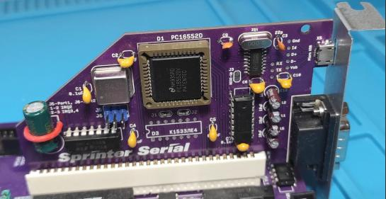

Карта портов RS-232 ISA-8
=========================

В данном репозитории представлен проект низкопрофильной (80мм) карты, формата ISA8, с двумя портами RS-232.

Карта разработана для любительского компьютера [Sprinter](https://www.sprinter.ru), с ним и тестировалась, но вполне возможно, что будет работать в старых компьютерах IBM PC с шиной ISA-8.

Построена на чипе PC16552D, который позволяет организовать 2 COM-порта. 

Порт COM1, включает TTL->USB преобразователь на чипе CH340C и позволяет подключиться к большому компьютеру с помощью кабеля Micro-USB к USB-порту.

Порт COM2, содержит преобразователь уровней TTL->RS-232 на чипе MAX-232. Снабжен стандартным разъемом DB-9M.

Адреса портов, стандартные:
* COM1 - 3F8 - 3FF
* COM2 - 2F8 - 2FF

[Исходники](Sources)

[Готовые схемы](Export)

[Герберы](Gerber)

